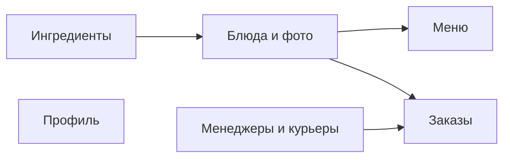
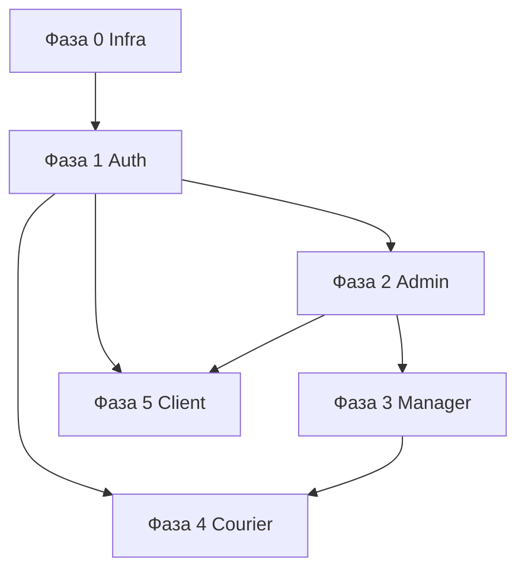

# Frontend Roadmap — Food Rush

Пошаговый план реализации веб-клиента Restaurant Management System: от HTTP-слоя и типов до экранов по ролям. Документ опирается на актуальную техдокументацию и готовый backend; **не заменяет** справочник API.

## Содержание

1. [Введение](#1-введение)
2. [Архитектурные решения](#2-архитектурные-решения)
3. [Pipeline «API → UI»](#3-pipeline-api--ui)
4. [Фаза 0 — Инфраструктура](#4-фаза-0--инфраструктура)
5. [Фаза 1 — Auth и маршрутизация](#5-фаза-1--auth-и-маршрутизация)
6. [Фаза 2 — Admin (desktop staff)](#6-фаза-2--admin-desktop-staff)
7. [Фаза 3 — Manager](#7-фаза-3--manager)
8. [Фаза 4 — Courier](#8-фаза-4--courier)
9. [Фаза 5 — Client](#9-фаза-5--client)
10. [Кросс-срезы](#10-кросс-срезы)
11. [Сводка прогресса](#11-сводка-прогресса)
12. [Приложение: покрытие API](#12-приложение-покрытие-api)
13. [Риски](#13-риски)

---

## 1. Введение

### Назначение

Roadmap задаёт **порядок работ**, артефакты [Feature-Sliced Design](https://feature-sliced.design) на каждом шаге и критерии готовности. Источники истины:

| Область                           | Документ                                                                                   |
| --------------------------------- | ------------------------------------------------------------------------------------------ |
| Продукт                           | [documentation/product/overview.md](../documentation/product/overview.md)                  |
| Роли и экраны                     | [documentation/roles/](../documentation/roles/)                                            |
| API                               | [documentation/api/](../documentation/api/), [swagger.yaml](../documentation/swagger.yaml) |
| Модель данных                     | [documentation/data/](../documentation/data/)                                              |
| Backend (приоритет при конфликте) | `backend/`, OpenAPI, `SecurityConfig`                                                      |

### Принятые решения

| Решение              | Выбор                                                                                                                                                  |
| -------------------- | ------------------------------------------------------------------------------------------------------------------------------------------------------ |
| Приложение           | Один Next.js 16: общий вход, layout по роли (desktop / mobile)                                                                                         |
| HTTP                 | Нативный `fetch` → класс **`HttpService`** (`shared/api/`)                                                                                             |
| API-сущности         | Классы **`*Service`** поверх `HttpService` (`DishService`, `OrderService`, …), **без** codegen из OpenAPI                                              |
| Серверное состояние  | **SWR** (списки, детали, мутации через `mutate`)                                                                                                       |
| Клиентское состояние | **Zustand** (+ **`persist`** для корзины и при необходимости UI-сессии)                                                                                |
| Валидация            | **Zod** — схемы ответов API и ручная валидация форм; **react-hook-form не используем**                                                                 |
| Формы                | Controlled inputs + ручная валидация (форм мало, модалки простые)                                                                                      |
| UI                   | Макеты из [пояснительная-записка/assets](../documentation/пояснительная-записка/assets/); сборка из [shared/ui](src/shared/ui/), минимум сырой вёрстки |
| MVP-порядок          | Инфраструктура → auth → desktop staff (**admin** → **manager**) → courier → client                                                                     |
| Именование JSON      | Поля TypeScript **1:1 snake_case** с API (`first_name`, `status_name`)                                                                                 |

### Текущее состояние frontend

| Компонент                                      | Статус                                      |
| ---------------------------------------------- | ------------------------------------------- |
| FSD-скaffold, shadcn/ui                        | Готово                                      |
| `shared/config/env.ts` (`NEXT_PUBLIC_API_URL`) | Готово                                      |
| `shared/api/`                                  | `HttpService`, ошибки, типы — готово        |
| Зависимости                                    | SWR, Zustand, Zod — установлены             |
| `entities/role`, `widgets/layouts`             | Пилот role + layouts staff/mobile           |
| Страницы                                       | `/`, `/staff`, `/courier`, `/app`, `/login`, `/register` |
| `entities/session`, `features/auth`            | Auth, redirect, logout — готово (фаза 1)    |

### Текущее состояние backend

- REST API на `http://localhost:8080`, JSON **snake_case**
- Два JWT-контура: сотрудники (`jwtEmployee`) и клиенты (`jwtClient`) — [errors-and-auth.md](../documentation/api/errors-and-auth.md)
- В access-токене claim `authorities`: `EMPLOYEE` или `CLIENT`, для сотрудника дополнительно `ADMIN` | `MANAGER` | `COURIER`

### Глоссарий

| Термин                        | Значение                                            |
| ----------------------------- | --------------------------------------------------- |
| `user_type`                   | `EMPLOYEE` или `CLIENT` в БД; определяет контур JWT |
| `ADMIN`, `MANAGER`, `COURIER` | Роли сотрудника (`roles.name`), authority в JWT     |
| Desktop layout                | Боковое меню — admin, manager                       |
| Mobile layout                 | Нижняя навигация — courier, client                  |

### Матрица «роль → маршруты → layout»

| Роль          | Код       | Layout            | Базовый prefix | Документация UI                                 |
| ------------- | --------- | ----------------- | -------------- | ----------------------------------------------- |
| Администратор | `ADMIN`   | Desktop sidebar   | `/staff`       | [admin.md](../documentation/roles/admin.md)     |
| Менеджер      | `MANAGER` | Desktop sidebar   | `/staff`       | [manager.md](../documentation/roles/manager.md) |
| Курьер        | `COURIER` | Mobile bottom nav | `/courier`     | [courier.md](../documentation/roles/courier.md) |
| Клиент        | `CLIENT`  | Mobile bottom nav | `/app`         | [client.md](../documentation/roles/client.md)   |

Общие экраны: вход ([fig-16](../documentation/пояснительная-записка/assets/fig-16-prototip-stranitsy-vhoda-v-sistemu.jpg)), ошибка входа ([fig-17](../documentation/пояснительная-записка/assets/fig-17-prototip-formy-vhoda-s-oshibkoy-avtorizatsii.jpg)), регистрация клиента — [roles/index.md](../documentation/roles/index.md).

### Out of scope (нет в API)

- **Оценить заказ** (кнопка в прототипе клиента) — UI-stub или скрыть; см. [client.md](../documentation/roles/client.md#функции-только-в-ui-нет-в-api)
- Роль повара (`COOK`) — не используется ([enums.md](../documentation/data/enums.md))

### Как вести прогресс

| Статус этапа | Значение                                |
| ------------ | --------------------------------------- |
| `не начата`  | Код этапа не писался                    |
| `в работе`   | Есть отмеченные `[x]`, но не все задачи |
| `завершена`  | Все задачи чеклиста `[x]`               |

- Фазы **0–5** и **§10 Кросс-срезы** — чеклисты **10–15 задач** (`- [ ]` / `- [x]`).
- В шапке каждой фазы: **Статус реализации**, **Прогресс** (`N / M`), **Комментарий к реализации**.
- После работы в коде обновляйте roadmap по [.cursor/rules/roadmap-progress.mdc](../.cursor/rules/roadmap-progress.mdc).

---

## 2. Архитектурные решения

### Маршрутизация Next.js

- `src/app/**` — только `page.tsx` / `layout.tsx` с re-export из `src/views/`
- UI страниц — в `src/views/<zone>/...`
- Route groups для layout:

```text
src/app/
├── (public)/
│   ├── login/page.tsx
│   └── register/page.tsx          # только client
├── (staff)/
│   └── staff/
│       ├── layout.tsx             # StaffDesktopLayout
│       ├── menus/page.tsx
│       ├── dishes/page.tsx
│       └── ...
├── (courier)/
│   └── courier/...
└── (client)/
    └── app/...
```

### Схема URL

| Зона           | Prefix                | Layout     | Роли               |
| -------------- | --------------------- | ---------- | ------------------ |
| Публичная      | `/login`, `/register` | minimal    | все                |
| Staff desktop  | `/staff/*`            | sidebar    | `ADMIN`, `MANAGER` |
| Courier mobile | `/courier/*`          | bottom nav | `COURIER`          |
| Client mobile  | `/app/*`              | bottom nav | `CLIENT`           |

Корень `/` — редирект: авторизован → home по роли; иначе → `/login`.

### Редирект после login

1. Сохранить `access_token`, `refresh_token`, контур (`employee` | `client`) в storage.
2. Декодировать payload JWT (без верификации на клиенте — только routing); прочитать `authorities`.
3. Маршрут:
   - есть `CLIENT` → `/app`
   - есть `COURIER` → `/courier`
   - есть `MANAGER` → `/staff` (менеджер: заказы как home или `/staff/orders`)
   - есть `ADMIN` → `/staff` (admin: меню или dashboard)
   - иначе → `/login` + toast «неизвестная роль»

Альтернатива/уточнение после login: `GET /employees/{id}` или `GET /clients/{id}` по `user_id` из отдельного claim, если backend добавит `sub` как id — **сейчас** в JWT только `subject` = login; для MVP достаточно `authorities`.

### Защита маршрутов

`src/middleware.ts`:

- Публичные: `/login`, `/register`, статика
- `/staff/*` — требует employee token + authority `ADMIN` или `MANAGER`
- `/courier/*` — employee token + `COURIER`
- `/app/*` — client token + `CLIENT`
- Несовпадение контура (client token на `/staff`) → logout + `/login`

Дублировать проверку в layout (client component) для UX при истечении токена.

### Корзина клиента

Backend **не** хранит корзину. Состояние: **Zustand** + **`persist`** в `features/cart/model/` (localStorage), сброс после успешного `POST /orders`.

### HttpService и entity-сервисы

Двухуровневый API-слой (по аналогии с `HttpService` в других проектах, на **fetch**, не Angular):

1. **`HttpService`** (`shared/api/http-service.ts`) — единая точка HTTP:
   - `resolveUrl`, заголовки (`Content-Type`, `Authorization`)
   - методы `get` / `post` / `put` / `patch` / `delete` / `upload` (multipart)
   - опциональный **Zod**-schema на ответ: `get(url, schema)` → распарсенный тип
   - обработка 401 → refresh → один retry
   - проброс `ApiError` / `ValidationErrorResponse`

2. **Entity-сервисы** — классы в `entities/<domain>/api/<domain>.service.ts`:
   - принимают `HttpService` (constructor injection или singleton)
   - инкапсулируют пути и тела: `DishService.updateDish(id, body)`, `MenuService.getMenus()`
   - экспорт через public API слайса: `entities/dish/index.ts`

Пример структуры:

```text
shared/api/http-service.ts      # HttpService
entities/dish/api/dish.service.ts   # DishService
entities/order/api/order.service.ts # OrderService
```

В UI и features вызывать **сервисы**, не `fetch` напрямую. Для чтения данных — **SWR**-хуки в `entities/<domain>/model/use-*.ts`, внутри которых вызывается соответствующий `*Service`.

### SWR и Zustand

| Библиотека  | Назначение                                                                                                           |
| ----------- | -------------------------------------------------------------------------------------------------------------------- |
| **SWR**     | Кэш GET-запросов, `isLoading` / `error`, `mutate` после POST/PATCH/DELETE, `refreshInterval` для отслеживания заказа |
| **Zustand** | Корзина клиента, при необходимости — лёгкий UI-state (sidebar, wizard step)                                          |
| **persist** | Только для данных, которые должны пережить перезагрузку (корзина); auth-токены — в `auth-storage`, не в Zustand      |

`SWRConfig` в [app-providers.tsx](src/application/providers/app-providers.tsx): общий `fetcher`, обработка ошибок, при необходимости `onError` → toast.

### UI и вёрстка

- **Источник макетов:** скриншоты в [documentation/пояснительная-записка/assets/](../documentation/пояснительная-записка/assets/) + описание экранов в [documentation/roles/](../documentation/roles/).
- **Компоненты:** [src/shared/ui/](src/shared/ui/) (shadcn) — `Button`, `Table`, `Dialog`, `Input`, `Card`, `Sheet` / `Drawer` (mobile), и т.д.
- **Не делать:** кастомную вёрстку там, где достаточно композиции kit (таблица, форма в `Dialog`, списки в `Card`).
- **Новые примитивы:** только через `npx shadcn@latest add`, в `shared/ui/`.
- Перед экраном — сверить fig-_ из `roles/_.md`с asset в`assets/`.

### Медиа-файлы

`POST /photos`, `POST /avatars` → multipart; отображение по URL из ответа или helper `shared/lib/media-url.ts` (база `NEXT_PUBLIC_API_URL` + путь `uploads/`).

---

## 3. Pipeline «API → UI»

Для каждой фичи в roadmap повторять чеклист (7 шагов):

| #   | Шаг            | Слой FSD                                         | Артефакт                                                                                  |
| --- | -------------- | ------------------------------------------------ | ----------------------------------------------------------------------------------------- |
| 1   | Контракт       | —                                                | Endpoint из [api/index.md](../documentation/api/index.md), примеры из тематического `.md` |
| 2   | Zod + types    | `entities/<domain>/model/schemas.ts`, `types.ts` | Схемы ответов; типы `z.infer<>` или дубли snake_case                                      |
| 3   | Entity service | `entities/<domain>/api/<domain>.service.ts`      | Класс `*Service` поверх `HttpService`                                                     |
| 4   | SWR hooks      | `entities/<domain>/model/use-*.ts`               | `useSWR` + вызов `*Service`; мутации → `mutate`                                           |
| 5   | Entity UI      | `entities/<domain>/ui/`                          | Карточка, строка таблицы, badge статуса                                                   |
| 6   | Feature        | `features/<action>/`                             | Сценарий; формы — controlled + ручная валидация + Zod при submit                          |
| 7   | View + route   | `views/`, `widgets/`, `app/`                     | Композиция из `shared/ui`; макет по fig-\*                                                |

### Definition of Done (общий)

- [ ] Запрос к реальному backend (`docker compose` в `backend/`)
- [ ] Обработка 401 (refresh или logout), 400, 404, 422 (`fields` на формах)
- [ ] Состояния loading / empty / error
- [ ] Соответствие макету: [пояснительная-записка/assets](../documentation/пояснительная-записка/assets/) + `documentation/roles/*.md`
- [ ] UI собран из `shared/ui`, без лишней кастомной вёрстки
- [ ] Данные через `*Service` + SWR, не прямой `fetch` в компонентах
- [ ] Public API слайса через `index.ts`
- [ ] Нет импортов «вверх» по FSD и между слайсами одного слоя

---

## 4. Фаза 0 — Инфраструктура

|                       |                                                              |
| --------------------- | ------------------------------------------------------------ |
| **Статус реализации** | `завершена`                                                  |
| **Прогресс**          | 15 / 15 задач                                                |
| **Зависит от**        | —                                                            |
| **Цель**              | HTTP-слой, storage, layouts, middleware — без бизнес-экранов |

**Комментарий к реализации:** `HttpService`, `errors`, `auth-storage` + cookie mirror, `jwt`, `media-url`, `next.config.ts` (proxy `/api`, `/uploads`), `middleware.ts`, layouts (`staff-desktop`, `mobile-bottom-nav`), `entities/role` (RoleService, useRoles), providers (SWR/Theme/Toaster). Маршруты `/staff`, `/courier`, `/app`, `/login` (форма входа admin/admin). Проверено: proxy, login, GET /roles на `/staff`, middleware → `/login` без токена.

### Задачи (чеклист)

- [x] Установить зависимости: `swr`, `zustand`, `zod` в `package.json`
- [x] Реализовать класс `HttpService` в `shared/api/http-service.ts` (get/post/put/patch/delete, `resolveUrl`, JSON, Bearer)
- [x] Добавить `shared/api/errors.ts` — `ApiError`, разбор 400/404/422
- [x] Добавить `shared/lib/auth-storage.ts` — токены employee/client (access + refresh)
- [x] Добавить `shared/lib/jwt.ts` — decode payload, `getAuthorities`, `getAuthKind`
- [x] Реализовать refresh при 401 в `HttpService` (`POST /auth/*/refresh`, один retry)
- [x] Реализовать `HttpService.upload()` для multipart (`FormData`)
- [x] Добавить `shared/lib/media-url.ts` для путей `uploads/`
- [x] Подключить в [app-providers.tsx](src/application/providers/app-providers.tsx): `SWRConfig`, `ThemeProvider`, `Toaster`
- [x] Создать `src/middleware.ts` — публичные и защищённые prefix (`/staff`, `/courier`, `/app`)
- [x] Сверстать `widgets/layouts/staff-desktop-layout/` по [fig-32](../documentation/пояснительная-записка/assets/fig-32-navigatsionnaya-model-interfeysa-administratora.jpg) (каркас, kit)
- [x] Сверстать `widgets/layouts/mobile-bottom-nav-layout/` (каркас под fig-33/34)
- [x] Добавить `shared/api/types.ts` — `ListResponse<T>` (поле `data` + `total` по backend/OpenAPI)
- [x] Пилот: `RoleService` + `useRoles()` (SWR) — `GET /roles`
- [x] Ручная проверка: login тестового employee → `GET /roles` → 200; refresh; middleware блокирует `/staff` без токена

---

## 5. Фаза 1 — Auth и маршрутизация

|                       |                                     |
| --------------------- | ----------------------------------- |
| **Статус реализации** | `завершена`                         |
| **Прогресс**          | 14 / 14 задач                       |
| **Зависит от**        | [Фаза 0](#4-фаза-0--инфраструктура) |

**Комментарий к реализации:** `entities/session` (AuthService, Zod), `features/auth` (employee/client login, register, logout, resolve-redirect, session-guard). Страницы: [login-page.tsx](src/views/auth/ui/login-page.tsx) (tabs), [client-register-page.tsx](src/views/auth/ui/client-register-page.tsx), [root-redirect-page.tsx](src/views/home/ui/root-redirect-page.tsx). Middleware: очистка cookie при неверном контуре. Регистрация → auto-session `/app`. Проверено: `npm run build`, admin/admin → `/staff`.

### Задачи (чеклист)

- [x] Zod-схемы: `TokenResponse`, `LoginRequest`, register body в `entities/session/model/schemas.ts`
- [x] `AuthService` в `entities/session/api/auth.service.ts` — employee/client login, register, refresh
- [x] Feature + view: вход сотрудника → `app/(public)/login`, [fig-16](../documentation/пояснительная-записка/assets/fig-16-prototip-stranitsy-vhoda-v-sistemu.jpg)
- [x] Отображение ошибки входа (401) на форме — [fig-17](../documentation/пояснительная-записка/assets/fig-17-prototip-formy-vhoda-s-oshibkoy-avtorizatsii.jpg)
- [x] Feature + view: регистрация клиента → `/register` ([client.md](../documentation/roles/client.md))
- [x] Feature: вход клиента (отдельный flow или таб на login — по макету)
- [x] `features/auth/logout/` — очистка storage, redirect `/login`
- [x] `features/auth/resolve-redirect/` — `resolveHomePath(authorities)` → `/staff` \| `/courier` \| `/app`
- [x] `app/page.tsx` — редирект `/` по сессии
- [x] Ссылка «Регистрация» на экране входа сотрудника → `/register`
- [x] Интеграция middleware с `auth-storage` (контур employee vs client)
- [x] Проверка: ADMIN/MANAGER login → `/staff`
- [x] Проверка: CLIENT login → `/app`; COURIER → `/courier`
- [x] Проверка: register client → login или auto-session

### 5.1 Employee login (справка)

| Шаг       | Детали                                                                                                                                                                                                                 |
| --------- | ---------------------------------------------------------------------------------------------------------------------------------------------------------------------------------------------------------------------- |
| Контракт  | `POST /auth/employees/login`, `POST /auth/employees/refresh`                                                                                                                                                           |
| Zod/types | `entities/session/model/schemas.ts` — `TokenResponse`, `LoginRequest`                                                                                                                                                  |
| Service   | `entities/session/api/auth.service.ts` — `loginEmployee`, `refreshEmployee`                                                                                                                                            |
| SWR       | не для login; после успеха — `mutate` при необходимости                                                                                                                                                                |
| Feature   | `features/auth/employee-login/` — controlled form, ручная валидация                                                                                                                                                    |
| View      | `views/auth/ui/employee-login-page.tsx` → `app/(public)/login/page.tsx`                                                                                                                                                |
| UI        | [fig-16](../documentation/пояснительная-записка/assets/fig-16-prototip-stranitsy-vhoda-v-sistemu.jpg), [fig-17](../documentation/пояснительная-записка/assets/fig-17-prototip-formy-vhoda-s-oshibkoy-avtorizatsii.jpg) |

### 5.2 Client register / login

| Шаг      | Детали                                                                             |
| -------- | ---------------------------------------------------------------------------------- |
| Контракт | `POST /auth/clients/register`, `login`, `refresh`                                  |
| Service  | `AuthService.loginClient`, `registerClient` (тот же `auth.service.ts`)             |
| Feature  | `features/auth/client-login/`, `features/auth/client-register/` — ручная валидация |
| View     | `views/auth/ui/client-register-page.tsx` → `/register`                             |
| UI       | [client.md](../documentation/roles/client.md)                                      |

На экране входа сотрудника — ссылка «Регистрация» → `/register` (только для клиентов).

### 5.3 Logout и session

| Артефакт                | Назначение                                                       |
| ----------------------- | ---------------------------------------------------------------- |
| `features/auth/logout/` | clear storage, redirect `/login`                                 |
| Zustand                 | опционально только для UI; токены — в `auth-storage`, не в store |

### 5.4 Role redirect

| Артефакт                          | Назначение                                                        |
| --------------------------------- | ----------------------------------------------------------------- |
| `features/auth/resolve-redirect/` | `resolveHomePath(authorities)` → `/staff` \| `/courier` \| `/app` |
| `app/page.tsx`                    | вызов redirect для `/`                                            |

---

## 6. Фаза 2 — Admin (desktop staff)

|                       |                                                                           |
| --------------------- | ------------------------------------------------------------------------- |
| **Статус реализации** | `завершена`                                                                |
| **Прогресс**          | 15 / 15 задач                                                             |
| **Зависит от**        | Фазы [0](#4-фаза-0--инфраструктура), [1](#5-фаза-1--auth-и-маршрутизация) |
| **Роль**              | `ADMIN`                                                                   |
| **Документация**      | [admin.md](../documentation/roles/admin.md)                               |

**Комментарий к реализации:** CRUD `/staff/*` (ингредиенты, блюда, меню, менеджеры, курьеры, заказы, настройки, справка). Entity: `ingredient`, `dish`, `menu`, `employee`, `order`, `order-status`; заказы — [фаза 3](#7-фаза-3--manager) (`/staff/orders`, Sheet). `npm run build` — OK.

### Задачи (чеклист)

- [x] Staff sidebar + маршруты `/staff/*` по [fig-32](../documentation/пояснительная-записка/assets/fig-32-navigatsionnaya-model-interfeysa-administratora.jpg) (Ресторан, Сотрудники, Настройки)
- [x] `IngredientService`, SWR `useIngredients`, страница `/staff/ingredients` — CRUD + модалки
- [x] `DishService`, `useDishes` / `useDish`, страница `/staff/dishes` — [fig-19](../documentation/пояснительная-записка/assets/fig-19-prototip-stranitsy-upravleniya-blyudami.jpg)
- [x] В модалке блюда: состав (`/dishes/{id}/ingredients`), фото (`/photos`, `/dishes/{id}/photos`), multipart upload
- [x] `MenuService`, страница `/staff/menus` — [fig-18](../documentation/пояснительная-записка/assets/fig-18-prototip-stranitsy-upravleniya-menyu.jpg), привязка блюд к меню
- [x] `EmployeeService`, `/staff/managers` — [fig-21](../documentation/пояснительная-записка/assets/fig-21-prototip-stranitsy-upravleniya-menedzherami.jpg), `role_id=2`
- [x] `/staff/couriers` — [fig-20](../documentation/пояснительная-записка/assets/fig-20-prototip-stranitsy-upravleniya-kurerami.jpg), `PATCH is_working`
- [x] Загрузка аватаров сотрудников (`POST /avatars`) в формах менеджер/курьер
- [x] `OrderService` (базовый) + страница `/staff/orders` — реализовано в [фазе 3](#7-фаза-3--manager)
- [x] Admin: `GET /order-statuses` — `entities/order-status`, dropdown в `order-edit-sheet`
- [x] `/staff/settings` — профиль сотрудника (`GET/PATCH /employees/{id}`), просмотр ролей
- [x] Обработка 422 на всех staff-формах (поля под inputs)
- [x] Состояния loading / empty / error на таблицах (SWR)
- [x] Скрытие admin-only пунктов sidebar для будущего manager (заложить `authorities`)
- [x] Ручной прогон: CRUD ингредиент → блюдо → меню → сотрудник против backend

### Порядок разделов (зависимости)



### 6.1 Ингредиенты

| Поле     | Значение                                                                                                                               |
| -------- | -------------------------------------------------------------------------------------------------------------------------------------- |
| Route    | `/staff/ingredients`                                                                                                                   |
| View     | `views/staff/ingredients/ui/ingredients-page.tsx`                                                                                      |
| Widget   | `widgets/ingredients-table/`                                                                                                           |
| Features | `features/ingredient/create`, `update`, `delete`                                                                                       |
| Entity   | `entities/ingredient/` — `IngredientService`, `useIngredients()` (SWR)                                                                 |
| Макет    | [fig-32](../documentation/пояснительная-записка/assets/fig-32-navigatsionnaya-model-interfeysa-administratora.jpg) (группа «Ресторан») |

| Метод     | Endpoint            | UI                      |
| --------- | ------------------- | ----------------------- |
| GET       | `/ingredients`      | Таблица                 |
| GET       | `/ingredients/{id}` | Деталь / preload edit   |
| POST      | `/ingredients`      | Модалка «Создать»       |
| PUT/PATCH | `/ingredients/{id}` | Модалка «Редактировать» |
| DELETE    | `/ingredients/{id}` | Confirm + удаление      |

### 6.2 Блюда и фото

| Поле    | Значение                                                                                                   |
| ------- | ---------------------------------------------------------------------------------------------------------- |
| Route   | `/staff/dishes`                                                                                            |
| View    | `views/staff/dishes/ui/dishes-page.tsx`                                                                    |
| Service | `entities/dish/api/dish.service.ts` — **`DishService`** (`getDishes`, `updateDish`, `createDish`, …)       |
| SWR     | `useDishes()`, `useDish(id)`                                                                               |
| Макет   | [fig-19](../documentation/пояснительная-записка/assets/fig-19-prototip-stranitsy-upravleniya-blyudami.jpg) |

| Метод     | Endpoint                                      | UI                                           |
| --------- | --------------------------------------------- | -------------------------------------------- |
| GET       | `/dishes`                                     | Таблица: название, цена, число ингредиентов  |
| GET       | `/dishes/{id}`                                | Модалка редактирования                       |
| POST      | `/dishes`                                     | Создание                                     |
| PUT/PATCH | `/dishes/{id}`                                | Поля: название, вес, калории, цена, описание |
| DELETE    | `/dishes/{id}`                                | Удаление                                     |
| GET       | `/dishes/{dishId}/ingredients`                | Список в модалке                             |
| POST      | `/dishes/{dishId}/ingredients`                | Добавить ингредиент                          |
| DELETE    | `/dishes/{dishId}/ingredients/{ingredientId}` | Убрать из состава                            |
| POST      | `/photos`                                     | Загрузка файла (multipart)                   |
| GET       | `/photos/{id}`                                | Метаданные                                   |
| DELETE    | `/photos/{id}`                                | Удаление файла                               |
| GET       | `/dishes/{dishId}/photos`                     | Галерея в модалке                            |
| POST      | `/dishes/{dishId}/photos`                     | Привязка фото к блюду                        |
| DELETE    | `/dishes/{dishId}/photos/{photoId}`           | Отвязка                                      |

### 6.3 Меню

| Поле  | Значение                                                                                                |
| ----- | ------------------------------------------------------------------------------------------------------- |
| Route | `/staff/menus`                                                                                          |
| View  | `views/staff/menus/ui/menus-page.tsx`                                                                   |
| Макет | [fig-18](../documentation/пояснительная-записка/assets/fig-18-prototip-stranitsy-upravleniya-menyu.jpg) |

| Метод     | Endpoint                          | UI                                                |
| --------- | --------------------------------- | ------------------------------------------------- |
| GET       | `/menus`                          | Таблица меню                                      |
| POST      | `/menus`                          | Создать                                           |
| GET       | `/menus/{id}`                     | Редактирование: название, сезонность, `is_active` |
| PUT/PATCH | `/menus/{id}`                     | Сохранить                                         |
| DELETE    | `/menus/{id}`                     | Удалить                                           |
| GET       | `/menus/{menuId}/dishes`          | Список блюд в меню                                |
| POST      | `/menus/{menuId}/dishes`          | Добавить блюдо                                    |
| DELETE    | `/menus/{menuId}/dishes/{dishId}` | Убрать блюдо                                      |

### 6.4 Менеджеры

| Поле   | Значение                                                                                                       |
| ------ | -------------------------------------------------------------------------------------------------------------- |
| Route  | `/staff/managers`                                                                                              |
| View   | `views/staff/managers/ui/managers-page.tsx`                                                                    |
| Entity | `entities/employee/`                                                                                           |
| Query  | `GET /employees?role_id=2`                                                                                     |
| Макет  | [fig-21](../documentation/пояснительная-записка/assets/fig-21-prototip-stranitsy-upravleniya-menedzherami.jpg) |

| Метод      | Endpoint               | UI                                                         |
| ---------- | ---------------------- | ---------------------------------------------------------- |
| GET        | `/employees?role_id=2` | Таблица                                                    |
| POST       | `/employees`           | Модалка: ФИО, телефон, email, login, password, `role_id=2` |
| GET        | `/employees/{id}`      | Редактирование                                             |
| PUT/PATCH  | `/employees/{id}`      | Только **Admin**                                           |
| DELETE     | `/employees/{id}`      | Только **Admin**                                           |
| POST       | `/avatars`             | Аватар в форме сотрудника                                  |
| GET/DELETE | `/avatars/{id}`        | По необходимости                                           |

### 6.5 Курьеры

| Поле  | Значение                                                                                                   |
| ----- | ---------------------------------------------------------------------------------------------------------- |
| Route | `/staff/couriers`                                                                                          |
| View  | `views/staff/couriers/ui/couriers-page.tsx`                                                                |
| Query | `GET /employees?role_id=3`                                                                                 |
| Макет | [fig-20](../documentation/пояснительная-записка/assets/fig-20-prototip-stranitsy-upravleniya-kurerami.jpg) |

| Метод     | Endpoint               | UI                             |
| --------- | ---------------------- | ------------------------------ |
| GET       | `/employees?role_id=3` | Таблица + колонка `is_working` |
| POST      | `/employees`           | Создание (`role_id=3`)         |
| PATCH     | `/employees/{id}`      | Смена `is_working` из таблицы  |
| Остальное | как менеджеры          | CRUD только Admin              |

### 6.6 Заказы (admin = manager)

| Поле  | Значение                                                                                                             |
| ----- | -------------------------------------------------------------------------------------------------------------------- |
| Route | `/staff/orders`                                                                                                      |
| View  | `views/staff/orders/ui/orders-page.tsx` (общий с manager)                                                            |
| Макет | [fig-22](../documentation/пояснительная-записка/assets/fig-22-prototip-stranitsy-upravleniya-zakazami-menedzher.jpg) |

Реализовать вместе с [фазой 3](#7-фаза-3--manager); admin подключает тот же view.

| Метод                 | Endpoint                               | UI                                   |
| --------------------- | -------------------------------------- | ------------------------------------ |
| GET                   | `/orders`                              | Таблица заказов                      |
| GET                   | `/orders/{id}`                         | Модалка деталей                      |
| PUT/PATCH             | `/orders/{id}`                         | Назначение курьера, правки           |
| DELETE                | `/orders/{id}`                         | Отмена (admin)                       |
| GET/POST              | `/orders/{orderId}/status-history`     | Смена статуса                        |
| GET/POST/PATCH/DELETE | `/orders/{orderId}/items`              | Состав заказа                        |
| GET                   | `/employees?role_id=3&is_working=true` | Выбор курьера                        |
| GET                   | `/order-statuses`                      | **Только admin** — dropdown статусов |
| GET                   | `/order-statuses/{id}`                 | Деталь справочника (редко)           |

### 6.7 Справочники и настройки

| Поле    | Значение                                                                                    |
| ------- | ------------------------------------------------------------------------------------------- |
| Route   | `/staff/settings`                                                                           |
| API     | `GET /roles`, `GET /roles/{id}` (admin)                                                     |
| Профиль | `GET/PATCH /employees/{id}` — свой профиль по login → найти id через list или будущий `/me` |

Навигация admin: [fig-32](../documentation/пояснительная-записка/assets/fig-32-navigatsionnaya-model-interfeysa-administratora.jpg) — группы «Ресторан», «Сотрудники», «Настройки», «Справка».

---

## 7. Фаза 3 — Manager

|                       |                                                         |
| --------------------- | ------------------------------------------------------- |
| **Статус реализации** | `завершена`                                             |
| **Прогресс**          | 12 / 12 задач                                           |
| **Зависит от**        | [Фаза 2](#6-фаза-2--admin-desktop-staff) (общие entity) |
| **Роль**              | `MANAGER`                                               |

**Комментарий к реализации:** `/staff/orders` и `/staff/clients` (общие с admin): `entities/order`, `order-status`, `client`; widgets `orders-table`, `clients-table`, `client-detail-sheet`; `features/order/assign-courier` (сценарий § «Назначить заказ курьеру» — ⋮ → отдельное окно, `PATCH` + `DELIVERING`), `features/order/edit` (редактирование без поля курьера). Таблица заказов: №, статус, клиент, адрес, время; фильтр «Новые», «Обновить». Статус — `status-history` + `ORDER_STATUS_CATALOG`. Home/middleware → `/staff/orders`; manager без `/staff/managers|couriers`.

### Reuse (без дублирования views)

| Раздел                   | Источник               | Ограничения manager                |
| ------------------------ | ---------------------- | ---------------------------------- |
| Меню, блюда, ингредиенты | Те же `views/staff/*`  | Нет раздела «Сотрудники» в sidebar |
| Настройки                | `views/staff/settings` | Профиль сотрудника                 |

### Уникальные экраны

#### 7.1 Заказы

| Шаг      | Артефакт                                                                             |
| -------- | ------------------------------------------------------------------------------------ |
| View     | `views/staff/orders/` (shared с admin)                                               |
| Features | `features/order/update-status`, `assign-courier`, `cancel-order`, `edit-order-items` |
| Entity   | `entities/order/`, `entities/order-status/` (локальные константы из ответа заказа)   |

**Важно:** `GET /order-statuses` **недоступен** manager. Dropdown статусов строить из:

- `status_name` в `GET /orders/{id}`
- записей `GET /orders/{orderId}/status-history`
- захардкоженный список из [enums.md](../documentation/data/enums.md) только как fallback UI

| Метод | Endpoint                                                      |
| ----- | ------------------------------------------------------------- |
| GET   | `/orders`, `/orders/{id}`                                     |
| PATCH | `/orders/{id}` (курьер, поля заказа)                          |
| POST  | `/orders/{orderId}/status-history`                            |
| CRUD  | `/orders/{orderId}/items` (без DELETE позиции — только admin) |
| GET   | `/employees?role_id=3`, `?is_working=true`                    |

#### 7.2 Клиенты

| Поле  | Значение                                  |
| ----- | ----------------------------------------- |
| Route | `/staff/clients`                          |
| View  | `views/staff/clients/ui/clients-page.tsx` |

| Метод         | Endpoint                        | UI                                           |
| ------------- | ------------------------------- | -------------------------------------------- |
| GET           | `/clients`                      | Список                                       |
| POST          | `/clients`                      | Создание                                     |
| GET/PATCH     | `/clients/{id}`                 | Карточка / редактирование                    |
| PUT           | `/clients/{id}`                 | Полное обновление                            |
| DELETE        | `/clients/{id}`                 | **Только admin** — кнопку скрыть для manager |
| GET/POST      | `/clients/{clientId}/addresses` | В карточке клиента (manager создаёт адрес)   |
| GET/PUT/PATCH | `/clients/.../addresses/{id}`   | Редактирование                               |
| DELETE        | `.../addresses/{id}`            | **Только admin**                             |

### Задачи (чеклист)

- [x] Доработать `OrderService` — список, деталь, items, status-history
- [x] Страница `/staff/orders` — таблица + Sheet заказа [fig-22](../documentation/пояснительная-записка/assets/fig-22-prototip-stranitsy-upravleniya-zakazami-menedzher.jpg)
- [x] Назначение курьера (`PATCH /orders/{id}`, выбор из `GET /employees?role_id=3&is_working=true`)
- [x] Смена статуса через `POST /orders/{id}/status-history` **без** `GET /order-statuses` (статус из history + enums)
- [x] Редактирование позиций заказа (`/orders/{id}/items`), DELETE позиции — admin и manager
- [x] `ClientService` + `useClients` / `useClient`
- [x] Страница `/staff/clients` — список и карточка клиента
- [x] Адреса клиента в карточке (`/clients/{id}/addresses`); скрыть DELETE клиента/адреса для manager
- [x] Sidebar manager: без «Менеджеры»/«Курьеры»; home → `/staff/orders`
- [x] Reuse `/staff/menus`, `/staff/dishes`, `/staff/ingredients` для роли MANAGER
- [x] Отмена заказа через status-history (не DELETE заказа)
- [x] Ручной прогон: manager login → заказ → назначить курьера → сменить статус → клиент

---

## 8. Фаза 4 — Courier

|                       |                                                                                                                      |
| --------------------- | -------------------------------------------------------------------------------------------------------------------- |
| **Статус реализации** | `завершена`                                                                                                          |
| **Прогресс**          | 12 / 12 задач                                                                                                        |
| **Зависит от**        | Фазы [0](#4-фаза-0--инфраструктура), [1](#5-фаза-1--auth-и-маршрутизация), `OrderService` из [3](#7-фаза-3--manager) |
| **Документация**      | [courier.md](../documentation/roles/courier.md)                                                                      |

**Комментарий к реализации:** `/employees/me`, enriched `OrderResponse` (адрес, ФИО клиента), `patchMe` для смены и профиля; без dev-заглушек. Ручной прогон — [MANUAL_TEST.md](MANUAL_TEST.md) (courier/manager).

### Маршруты

| Route                  | View                          | Макет                                                                                                         |
| ---------------------- | ----------------------------- | ------------------------------------------------------------------------------------------------------------- |
| `/courier`             | redirect → orders             | —                                                                                                             |
| `/courier/orders`      | `views/courier/orders/`       | [fig-23](../documentation/пояснительная-записка/assets/fig-23-prototip-stranitsy-spiska-zakazov-kurera.jpg)   |
| `/courier/orders/[id]` | `views/courier/order-detail/` | [fig-24](../documentation/пояснительная-записка/assets/fig-24-prototip-stranitsy-kartochki-zakaza-kurera.jpg) |
| `/courier/profile`     | `views/courier/profile/`      | [fig-26](../documentation/пояснительная-записка/assets/fig-26-prototip-stranitsy-profilya-kurera.jpg)         |

### Pipeline по фичам

| Фича            | API                                                           | Features / entities                                                                                                   |
| --------------- | ------------------------------------------------------------- | --------------------------------------------------------------------------------------------------------------------- |
| Список заказов  | `GET /orders` (свои, `courier_id`)                            | `entities/order`, `features/courier/toggle-working`                                                                   |
| Рабочий статус  | `PATCH /employees/{id}` (`is_working`)                        | Переключатель на списке и в профиле                                                                                   |
| Карточка заказа | `GET /orders/{id}`, `GET .../items`, `GET .../status-history` | `widgets/order-status-stepper/`                                                                                       |
| Смена статуса   | `POST /orders/{orderId}/status-history`                       | [fig-25](../documentation/пояснительная-записка/assets/fig-25-prototip-ekrana-podtverzhdeniya-smeny-statusa-zaka.jpg) |
| Профиль         | `GET/PATCH /employees/{id}`                                   | `features/courier/edit-profile`                                                                                       |

### Маппинг статусов UI ↔ API

| UI (упрощённо) | Код API          | Примечание                      |
| -------------- | ---------------- | ------------------------------- |
| Принят         | `NEW`, `COOKING` | На макете одна ступень «Принят» |
| В пути         | `DELIVERING`     |                                 |
| Доставлен      | `DELIVERED`      |                                 |
| Отменён        | `CANCELLED`      | Только отображение              |

Справочник `GET /order-statuses` **не использовать** (только admin).

### Задачи (чеклист)

- [x] Route group `(courier)` + `MobileBottomNavLayout` для курьера
- [x] `/courier` → redirect на `/courier/orders`
- [x] Список заказов [fig-23](../documentation/пояснительная-записка/assets/fig-23-prototip-stranitsy-spiska-zakazov-kurera.jpg) — SWR `GET /orders` (свои)
- [x] Переключатель `is_working` (`PATCH /employees/{id}`) на списке и в профиле
- [x] Карточка заказа `/courier/orders/[id]` — [fig-24](../documentation/пояснительная-записка/assets/fig-24-prototip-stranitsy-kartochki-zakaza-kurera.jpg)
- [x] Widget `order-status-stepper` — упрощённая шкала UI ↔ API (см. таблицу статусов ниже)
- [x] Экран подтверждения смены статуса — [fig-25](../documentation/пояснительная-записка/assets/fig-25-prototip-ekrana-podtverzhdeniya-smeny-statusa-zaka.jpg)
- [x] `POST /orders/{id}/status-history` после подтверждения
- [x] Профиль `/courier/profile` — [fig-26](../documentation/пояснительная-записка/assets/fig-26-prototip-stranitsy-profilya-kurera.jpg), `GET/PATCH /employees/{id}`
- [x] Bottom nav [fig-33](../documentation/пояснительная-записка/assets/fig-33-navigatsionnaya-model-interfeysa-kurera.jpg)
- [x] Опционально: `refreshInterval` в SWR на списке/детали заказа
- [x] Ручной прогон: courier login → смена → заказ → статус → доставлен (сценарий в [MANUAL_TEST.md](MANUAL_TEST.md))

---

## 9. Фаза 5 — Client

|                       |                                                                                                   |
| --------------------- | ------------------------------------------------------------------------------------------------- |
| **Статус реализации** | `завершена`                                                                                       |
| **Прогресс**          | 15 / 15 задач                                                                                     |
| **Зависит от**        | Фазы [0](#4-фаза-0--инфраструктура), [1](#5-фаза-1--auth-и-маршрутизация); entity dish/menu/order |
| **Документация**      | [client.md](../documentation/roles/client.md)                                                     |

**Комментарий к реализации:** `views/client/*`, cart/checkout, `OrderTrackingStepper`. Ручной прогон — [MANUAL_TEST.md](MANUAL_TEST.md).

### Маршруты

| Route              | Назначение       | Макет                                                                                                       |
| ------------------ | ---------------- | ----------------------------------------------------------------------------------------------------------- |
| `/register`        | Регистрация      | client.md                                                                                                   |
| `/app`             | Меню (вкладки)   | [fig-27](../documentation/пояснительная-записка/assets/fig-27-prototip-stranitsy-prosmotra-menyu.jpg)       |
| `/app/dishes/[id]` | Карточка блюда   | [fig-28](../documentation/пояснительная-записка/assets/fig-28-prototip-stranitsy-kartochki-blyuda.jpg)      |
| `/app/cart`        | Корзина          | [fig-34](../documentation/пояснительная-записка/assets/fig-34-navigatsionnaya-model-interfeysa-klienta.jpg) |
| `/app/orders`      | История          | [fig-29](../documentation/пояснительная-записка/assets/fig-29-prototip-stranitsy-istorii-zakazov.jpg)       |
| `/app/orders/[id]` | Отслеживание     | [fig-30](../documentation/пояснительная-записка/assets/fig-30-prototip-stranitsy-otslezhivaniya-zakaza.jpg) |
| `/app/profile`     | Профиль и адреса | [fig-31](../documentation/пояснительная-записка/assets/fig-31-prototip-stranitsy-profilya-polzovatelya.jpg) |

### Pipeline по фичам

| Фича         | API                                                                                                         | Слой                                                                                                                                                                                                                                                                                                            |
| ------------ | ----------------------------------------------------------------------------------------------------------- | --------------------------------------------------------------------------------------------------------------------------------------------------------------------------------------------------------------------------------------------------------------------------------------------------------------- |
| Меню витрина | `GET /menus?is_active=true`, `GET /menus/{id}/dishes`, `GET /dishes/{id}`                                   | `views/client/menu`, `entities/menu`, `entities/dish`                                                                                                                                                                                                                                                           |
| Корзина      | **Zustand + persist** + `POST /orders`, `POST /orders/{id}/items`                                           | `features/cart/*`, `OrderService`                                                                                                                                                                                                                                                                               |
| Оформление   | `GET/POST /clients/{id}/addresses`                                                                          | `features/checkout/*`                                                                                                                                                                                                                                                                                           |
| История      | `GET /orders` (свои)                                                                                        | `views/client/orders`                                                                                                                                                                                                                                                                                           |
| Отслеживание | `GET /orders/{id}`, `GET .../status-history`, `POST .../status-history` (отмена клиентом — по правилам API) | `widgets/order-tracking-stepper/`                                                                                                                                                                                                                                                                               |
| Профиль      | `GET/PATCH /clients/{id}`, addresses CRUD                                                                   | `features/client/edit-profile`, `manage-addresses`                                                                                                                                                                                                                                                              |
| Аватар       | `POST /avatars`                                                                                             | multipart (если разрешено client в SecurityConfig — проверить: загрузка avatars admin/manager; client — **GET only** для avatars; для профиля клиента уточнить по [errors-and-auth.md](../documentation/api/errors-and-auth.md): POST avatars — Admin, Manager only → клиент **без** загрузки аватара или stub) |

> **Аватар клиента:** по SecurityConfig `POST /avatars` — только Admin, Manager. В [client.md](../documentation/roles/client.md) указан `POST /avatars` — при реализации либо stub, либо запись в [raszhozhdeniya-dokumentacii.md](../documentation/raszhozhdeniya-dokumentacii.md).

### Out of scope

- Кнопка «Оценить заказ» — не реализовывать (нет API)
- «Повторить заказ» — опционально: локально наполнить корзину из `GET /orders/{id}/items` (nice-to-have)

### Задачи (чеклист)

- [x] Route group `(client)` + mobile layout; bottom nav [fig-34](../documentation/пояснительная-записка/assets/fig-34-navigatsionnaya-model-interfeysa-klienta.jpg)
- [x] `features/cart` — Zustand store + `persist` (localStorage)
- [x] Витрина `/app` — `GET /menus?is_active=true`, вкладки меню [fig-27](../documentation/пояснительная-записка/assets/fig-27-prototip-stranitsy-prosmotra-menyu.jpg)
- [x] `/app/dishes/[id]` — карточка блюда [fig-28](../documentation/пояснительная-записка/assets/fig-28-prototip-stranitsy-kartochki-blyuda.jpg), «В корзину»
- [x] `/app/cart` — изменение количества, итог
- [x] Checkout: выбор/создание адреса, `POST /orders` + items
- [x] `/app/orders` — история [fig-29](../documentation/пояснительная-записка/assets/fig-29-prototip-stranitsy-istorii-zakazov.jpg)
- [x] `/app/orders/[id]` — отслеживание [fig-30](../documentation/пояснительная-записка/assets/fig-30-prototip-stranitsy-otslezhivaniya-zakaza.jpg), SWR polling history
- [x] `/app/profile` — [fig-31](../documentation/пояснительная-записка/assets/fig-31-prototip-stranitsy-profilya-polzovatelya.jpg), `PATCH /clients/{id}`
- [x] Адреса доставки CRUD в профиле (ограничения DELETE по роли — см. API)
- [x] Аватар клиента: stub или только GET (POST `/avatars` недоступен client)
- [x] Не реализовывать «Оценить заказ» (out of scope)
- [x] Сброс корзины после успешного заказа
- [x] Ручной прогон: register → menu → cart → order → tracking → profile (сценарий в [MANUAL_TEST.md](MANUAL_TEST.md))

---

## 10. Кросс-срезы

|                       |             |
| --------------------- | ----------- |
| **Статус реализации** | `завершена` |
| **Прогресс**          | 8 / 9 задач |

**Комментарий к реализации:** `parseValidationError`, SWR toast (без 422/401), `eslint-plugin-boundaries`, `remotePatterns`, [MANUAL_TEST.md](MANUAL_TEST.md), Prettier scripts. Справка и «О разработчиках» — `views/help`, `views/about`, `content/help/*.md`. Playwright — backlog.

### Задачи (чеклист)

- [x] Справка: `/staff/help`, `/courier/help`, `/app/help` — Markdown, TOC с якорями, макеты в `public/help/assets/`
- [x] О разработчиках: `/staff/about`, `/courier/about`, `/app/about` — СамГУ, группа 6303-020302D, команда + Telegram
- [x] Навигация: sidebar staff, ссылки в профилях client/courier
- [x] Единый `parseValidationError` для 422 → поля форм
- [x] Toast (sonner) для 400/404/500 через `SWRConfig.onError` / `HttpService`
- [x] ESLint boundaries или `@feature-sliced/eslint-config` для FSD-импортов
- [x] `next.config` — `images.remotePatterns` для `uploads/` с backend
- [x] Ручной тест-чеклист (backend docker + сценарии по ролям) задокументирован
- [x] При расхождении UI/API — запись в [raszhozhdeniya-dokumentacii.md](../documentation/raszhozhdeniya-dokumentacii.md)
- [ ] Playwright E2E (backlog, после фазы 2)
- [x] Prettier / format script (если ещё нет в репо)

### Ошибки и формы

- **Формы:** controlled components; валидация вручную + **Zod** `safeParse` на submit; **без** react-hook-form
- 422 с backend → `parseValidationError` → сообщения под полями
- 401 → `HttpService` refresh → повтор; при неудаче → logout
- Toast для 400/404/500 (sonner)

### Слой данных

- Только `HttpService` и `*Service`; в компонентах — SWR-хуки или вызов сервиса в event handler + `mutate`
- Ответы API при необходимости валидировать Zod-схемой в `HttpService.get/post`

### Списки и пагинация

API возвращает полные списки (`ListResponse`); **пагинации нет** — на MVP таблицы без server-side page. При росте данных — client-side filter/search.

### Права в UI

- Скрывать кнопки DELETE, разделы sidebar по `authorities` (не только middleware)
- Manager не видит admin-only endpoints

### Тестирование (ручной чеклист)

1. `cd backend && docker compose up -d`
2. `cd frontend && npm run dev`
3. Сценарии по фазам: login каждой роли → CRUD раздела → logout
4. Негативные: неверный пароль, 422 на пустых полях, доступ чужой роли к URL

### E2E (backlog)

Playwright — после стабилизации фазы 2; не блокер roadmap.

### Синхронизация документации

При расхождении UI и API — запись в [raszhozhdeniya-dokumentacii.md](../documentation/raszhozhdeniya-dokumentacii.md). Пояснительную записку не править.

---

## 11. Сводка прогресса

| Фаза              | Статус      | Прогресс | Комментарий                                          |
| ----------------- | ----------- | -------- | ---------------------------------------------------- |
| 0. Инфраструктура | `завершена` | 15/15    | HttpService, proxy, middleware, layouts, RoleService |
| 1. Auth           | `завершена` | 14/14    | login/register, AuthService, role redirect, middleware |
| 2. Admin          | `завершена` | 15/15    | CRUD staff + заказы (shared с manager)               |
| 3. Manager        | `завершена` | 12/12    | Заказы, клиенты, reuse меню/блюд                     |
| 4. Courier        | `завершена` | 12/12    | `/employees/me`, OrderResponse enriched, MANUAL_TEST   |
| 5. Client         | `завершена` | 15/15    | Полный flow; MANUAL_TEST                             |
| 10. Кросс-срезы   | `завершена` | 8/9      | Справка + о разработчиках; Playwright — backlog        |

Детальные чеклисты — в секциях [4](#4-фаза-0--инфраструктура)–[10](#10-кросс-срезы). Обновляйте **Прогресс** и **Комментарий** в шапке каждой фазы при закрытии задач.



---

## 12. Приложение: покрытие API

Все операции из [documentation/api/index.md](../documentation/api/index.md) (75 шт.). Колонка **Фаза**: `0`–`5` или `—` (не вызывается с frontend).

| Метод  | URL                                           | Фаза    | Примечание                                                           |
| ------ | --------------------------------------------- | ------- | -------------------------------------------------------------------- |
| POST   | `/auth/clients/login`                         | 1       |                                                                      |
| POST   | `/auth/clients/refresh`                       | 0       | refresh helper                                                       |
| POST   | `/auth/clients/register`                      | 1       |                                                                      |
| POST   | `/auth/employees/login`                       | 1       |                                                                      |
| POST   | `/auth/employees/refresh`                     | 0       |                                                                      |
| POST   | `/avatars`                                    | 2, 5    | 2: staff forms; 5: **N/A** if client cannot upload — см. расхождение |
| GET    | `/avatars/{id}`                               | 2–5     | Отображение аватаров                                                 |
| DELETE | `/avatars/{id}`                               | 2       | Admin staff                                                          |
| GET    | `/clients`                                    | 3       | Manager                                                              |
| POST   | `/clients`                                    | 3       |                                                                      |
| GET    | `/clients/{clientId}/addresses`               | 3, 5    | Manager + client profile                                             |
| POST   | `/clients/{clientId}/addresses`               | 3, 5    | Manager create; client — если разрешено PATCH own                    |
| GET    | `/clients/{clientId}/addresses/{id}`          | 3, 5    |                                                                      |
| PUT    | `/clients/{clientId}/addresses/{id}`          | 3, 5    |                                                                      |
| PATCH  | `/clients/{clientId}/addresses/{id}`          | 3, 5    |                                                                      |
| DELETE | `/clients/{clientId}/addresses/{id}`          | 2       | Admin only                                                           |
| GET    | `/clients/{id}`                               | 3, 5    |                                                                      |
| PUT    | `/clients/{id}`                               | 3, 5    |                                                                      |
| PATCH  | `/clients/{id}`                               | 3, 5    |                                                                      |
| DELETE | `/clients/{id}`                               | 2       | Admin only                                                           |
| GET    | `/dishes`                                     | 2, 5    |                                                                      |
| POST   | `/dishes`                                     | 2       |                                                                      |
| GET    | `/dishes/{dishId}/ingredients`                | 2, 5    |                                                                      |
| POST   | `/dishes/{dishId}/ingredients`                | 2       |                                                                      |
| DELETE | `/dishes/{dishId}/ingredients/{ingredientId}` | 2       |                                                                      |
| GET    | `/dishes/{dishId}/photos`                     | 2, 5    |                                                                      |
| POST   | `/dishes/{dishId}/photos`                     | 2       |                                                                      |
| DELETE | `/dishes/{dishId}/photos/{photoId}`           | 2       |                                                                      |
| GET    | `/dishes/{id}`                                | 2, 5    |                                                                      |
| PUT    | `/dishes/{id}`                                | 2       |                                                                      |
| PATCH  | `/dishes/{id}`                                | 2       |                                                                      |
| DELETE | `/dishes/{id}`                                | 2       |                                                                      |
| GET    | `/employees`                                  | 2, 3, 4 | Filters: role_id, is_working                                         |
| POST   | `/employees`                                  | 2       | Admin                                                                |
| GET    | `/employees/{id}`                             | 2–4     | Profile                                                              |
| PUT    | `/employees/{id}`                             | 2       | Admin                                                                |
| PATCH  | `/employees/{id}`                             | 2, 4    | Admin + courier `is_working`                                         |
| DELETE | `/employees/{id}`                             | 2       | Admin                                                                |
| GET    | `/ingredients`                                | 2, 5    | 5: read-only in dish card                                            |
| POST   | `/ingredients`                                | 2       |                                                                      |
| GET    | `/ingredients/{id}`                           | 2       |                                                                      |
| PUT    | `/ingredients/{id}`                           | 2       |                                                                      |
| PATCH  | `/ingredients/{id}`                           | 2       |                                                                      |
| DELETE | `/ingredients/{id}`                           | 2       |                                                                      |
| GET    | `/menus`                                      | 2, 5    | 5: `?is_active=true`                                                 |
| POST   | `/menus`                                      | 2       |                                                                      |
| GET    | `/menus/{id}`                                 | 2, 5    |                                                                      |
| PUT    | `/menus/{id}`                                 | 2       |                                                                      |
| PATCH  | `/menus/{id}`                                 | 2       |                                                                      |
| DELETE | `/menus/{id}`                                 | 2       |                                                                      |
| GET    | `/menus/{menuId}/dishes`                      | 2, 5    |                                                                      |
| POST   | `/menus/{menuId}/dishes`                      | 2       |                                                                      |
| DELETE | `/menus/{menuId}/dishes/{dishId}`             | 2       |                                                                      |
| GET    | `/order-statuses`                             | 2       | Admin only                                                           |
| GET    | `/order-statuses/{id}`                        | 2       | Admin only                                                           |
| GET    | `/orders`                                     | 3–5     |                                                                      |
| POST   | `/orders`                                     | 3, 5    | Manager rare; client checkout                                        |
| GET    | `/orders/{id}`                                | 3–5     |                                                                      |
| PUT    | `/orders/{id}`                                | 3       | Manager                                                              |
| PATCH  | `/orders/{id}`                                | 3, 4, 5 | Courier, client limited                                              |
| DELETE | `/orders/{id}`                                | 2, 3    | Admin; manager cancel via status                                     |
| GET    | `/orders/{orderId}/items`                     | 3–5     |                                                                      |
| POST   | `/orders/{orderId}/items`                     | 3, 5    |                                                                      |
| GET    | `/orders/{orderId}/items/{id}`                | 3       | Detail                                                               |
| PUT    | `/orders/{orderId}/items/{id}`                | 3       |                                                                      |
| PATCH  | `/orders/{orderId}/items/{id}`                | 3, 5    |                                                                      |
| DELETE | `/orders/{orderId}/items/{id}`                | 2       | Admin                                                                |
| GET    | `/orders/{orderId}/status-history`            | 3–5     |                                                                      |
| POST   | `/orders/{orderId}/status-history`            | 3–5     |                                                                      |
| POST   | `/photos`                                     | 2       |                                                                      |
| GET    | `/photos/{id}`                                | 2, 5    |                                                                      |
| DELETE | `/photos/{id}`                                | 2       |                                                                      |
| GET    | `/roles`                                      | 0, 2    | Health-check; справочник                                             |
| GET    | `/roles/{id}`                                 | 2       | Admin                                                                |

**Итог аудита:** все 75 операций привязаны к фазе 0–5 или отмечены ограничением по роли (admin-only / client avatar).

---

## 13. Риски

| Риск                                    | Митигация                                                                       |
| --------------------------------------- | ------------------------------------------------------------------------------- |
| Два JWT-контура                         | Раздельные ключи storage; middleware по prefix                                  |
| snake_case в TypeScript                 | Типы 1:1 с API; без camelCase mapping на MVP                                    |
| Manager без `/order-statuses`           | Статусы из заказа и history; enum fallback                                      |
| Desktop + mobile в одном app            | Route groups + отдельные layouts                                                |
| Корзина только на клиенте               | Zustand + `persist` в `features/cart`                                           |
| Дублирование валидации                  | Zod-схемы рядом с типами entity; формы — `safeParse` перед вызовом `*Service`   |
| JWT без user id                         | Redirect по `authorities`; профиль — поиск по login или backend `/me` в будущем |
| client.md vs SecurityConfig для avatars | Зафиксировать в raszhozhdeniya при реализации профиля                           |

---

_Последнее обновление roadmap: добавлены статусы этапов, чеклисты задач и комментарии к реализации. При закрытии задачи — `[x]` в чеклисте и обновление прогресса в шапке фазы. При изменении API — сверять с [documentation/api/index.md](../documentation/api/index.md)._
